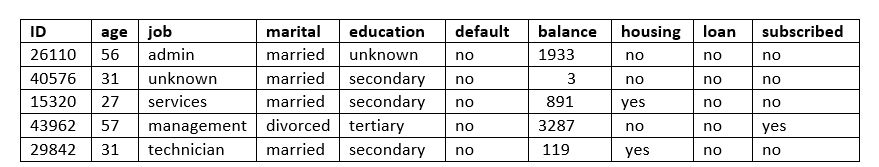
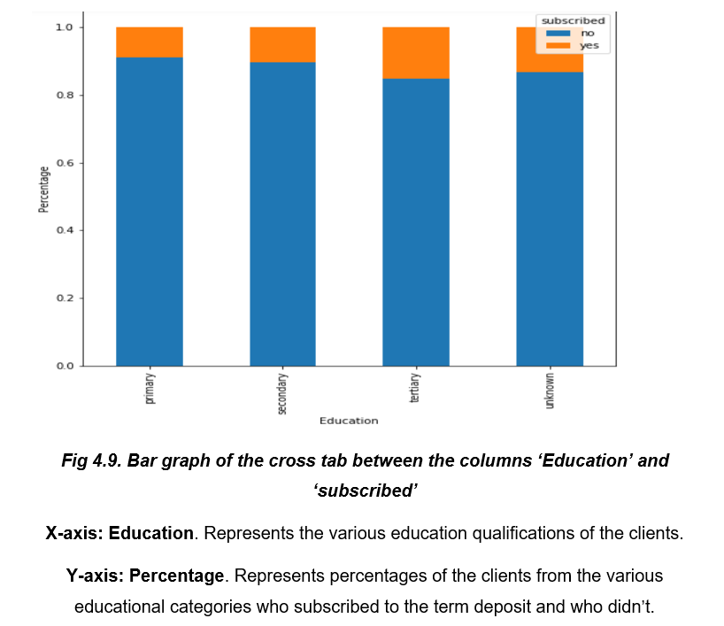
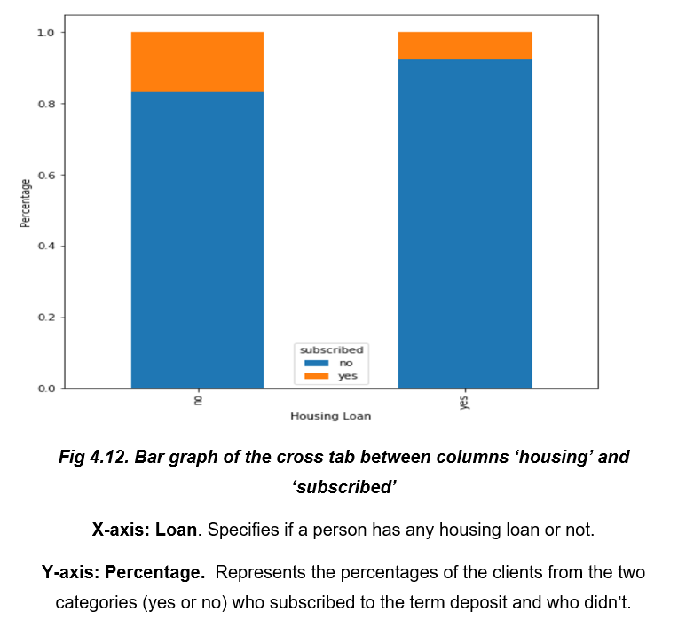
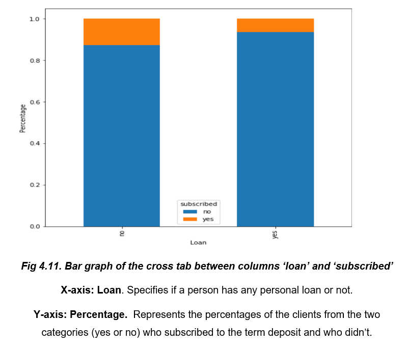
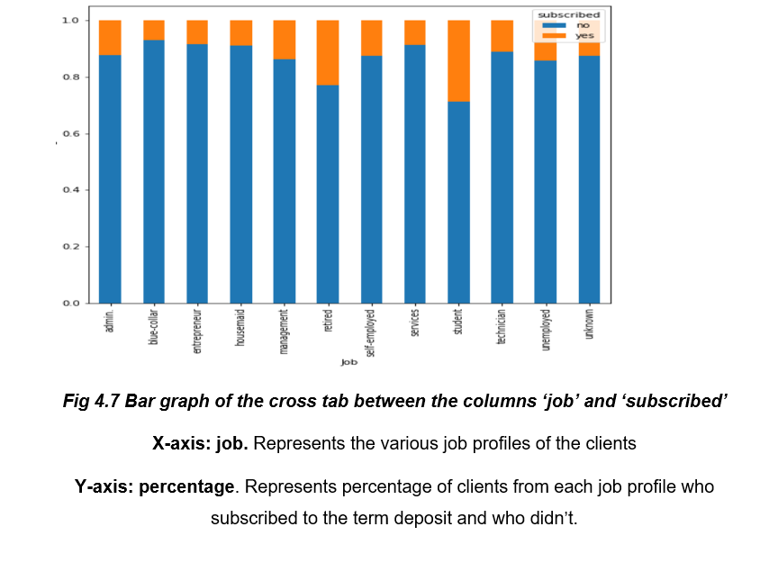
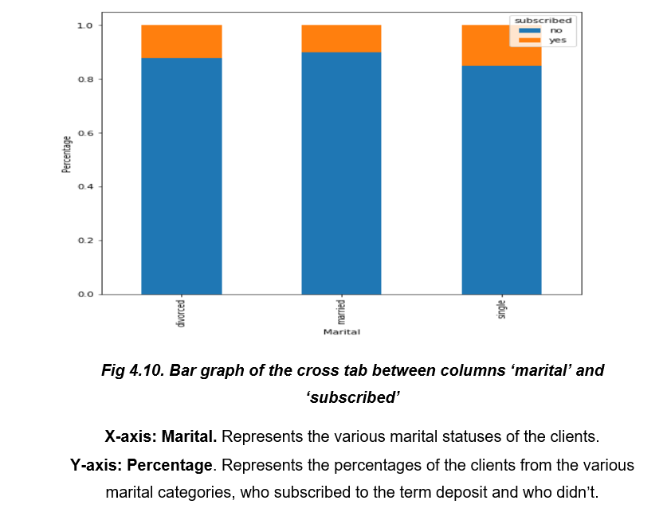

# Fixed-Deposit-Predictor

A predictive model which predicts if a customer will subscribe to a Fixed Deposit based on his financial and personal status. This model is implented using the python language.
The data-set used to train this model, has the following columns/features.

This is a classification problem, that predicts if a customer will subscribe to a term deposit based on his personal data, given below.

VARIABLE - DEFINITION

Id	      -  Unique id of client
age	      -  Age of client
Job	      -  Job of the client
Marital   -	 Marital status of the client
Education	-  Education of client
Default	  -  Credit in default(yes/no). Tells us if the customer has any unpaid loans.
Housing	  -  Housing loan(yes/no). Tells us if the customer has taken a housing loan in the past.
Loan	    -  Personal loan(yes/no). Tells us if the customer has taken a personal loan in the past.
Subscribed(target variable) -	Has the client subscribed to the term deposit.

From the dataset the first 8 columns(variables) are the predictor variables, and the final column is the target variable. Using a training data set the model is trained, and the testing data set is used to test the performance of the model when it's given unseen data. 

The first 5 rows of the data set looks something like this.

Results of bivariate analysis. Here I compared 2 variables. One predictor variable and one target variable. 
I've analysed the relation ships between the following 5 sets of variables.

1. Education of the customer and Subscribed(target variable)
2. Default status of the customer and Subscribed(target variable)
3. Housing loan history of customer and Subscribed.
4. Personal loan history of customer and Subscribed.
5. Martial status of customer and Subscribed.

 
 
 
 

 
 

 
 

 
 
 
 
 

 
